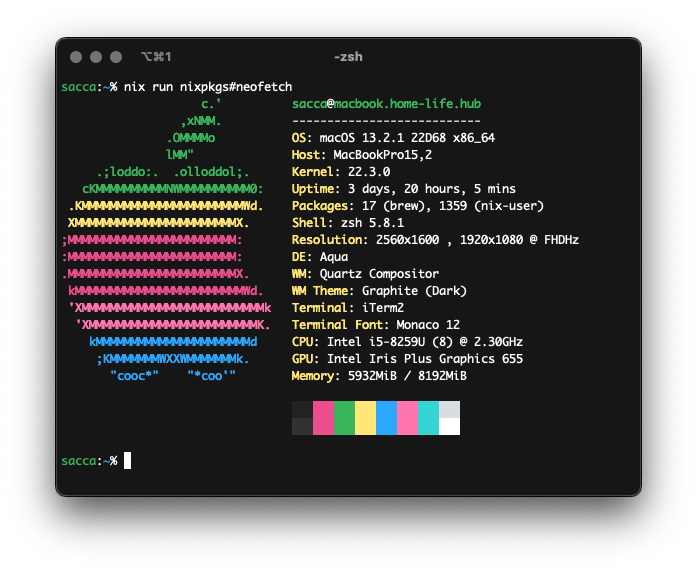
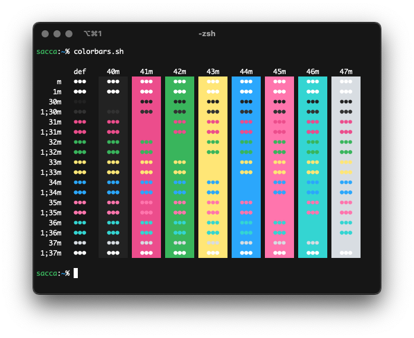

<div align="center">

# oxocarbon-iterm2

</div>

<div align="center">

[](https://github.com/nyoom-engineering/oxocarbon/stargazers)
[](https://github.com/nyoom-engineering/oxocarbon/issues)
[](https://mit-license.org/)


</div>

Oxocarbon is a set of community ports of IBM's carbon color palette and design philosophy to various applications and tooling.

## Showcase




## Install

1. Download the `.itermcolors` file with the following command:

```bash
cd $HOME/Downloads
curl -O https://raw.githubusercontent.com/nyoom-engineering/oxocarbon-iterm2/main/oxocarbon-dark.itermcolors
```

2. Go to `Settings -> Profiles -> Colors` and click `Color Presets` and then `import`. From the file picker, select the `.itermcolors` file in your downloads folder
3. Reclick `Color Presets` and than select `oxocarbon-dark`

## License

The project is licensed under the MIT license
